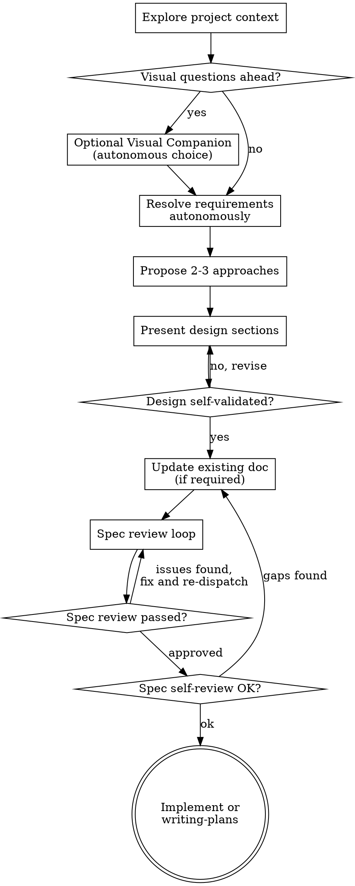

<!-- Copyright GraphCaster. All Rights Reserved. Text from Superpowers brainstorming skill; used by agent-queue CLI. -->
---
name: brainstorming
description: "You MUST use this before any creative work - creating features, building components, adding functionality, or modifying behavior. Explores requirements and design before implementation."
---

# Brainstorming Ideas Into Designs

Help turn ideas into fully formed designs and specs by analyzing the codebase and docs. **Do not poll or wait on the user:** find the most rational, correct, and logical solution independently (infer missing details from project context, document explicit assumptions where needed).

Start by understanding the current project context, then resolve ambiguities from files, conventions, and constraints—not by asking the user. Once you have a coherent picture of what you are building, document the design and self-validate it against project goals.

When naming files to read or edit, use paths **relative to the workspace root** (`agent-queue.ps1 -Workspace` / Cursor workspace), e.g. `doc/…` or `python/…` in graph-caster, or `docs/…` in the parent monorepo when that is the opened root.

## Anti-Pattern: "This Is Too Simple To Need A Design"

Every project goes through this process. A todo list, a single-function utility, a config change — all of them. "Simple" projects are where unexamined assumptions cause the most wasted work. The design can be short (a few sentences for truly simple projects), but you MUST capture it and self-validate before implementation.

## Checklist

You MUST create a task for each of these items and complete them in order:

1. **Explore project context** — check files, docs, recent commits
2. **Decide on visual companion** (if the topic benefits from mockups/diagrams) — see Visual Companion; choose autonomously whether to use browser tools; do not block on user consent
3. **Resolve requirements autonomously** — infer purpose, constraints, and success criteria from context; where still ambiguous, pick the most rational default and state it in the spec
4. **Propose 2-3 approaches** — with trade-offs and your recommendation
5. **Present design** — in sections scaled to their complexity; after each section, self-check consistency (no user gate)
6. **Record design where it belongs** — if documentation must change, update **only already existing** files under `docs/` that the task or `development-workflow.mdc` already points to (trackers, status, backlog rows). Match each file’s structure and tone; do **not** create new files under `docs/superpowers/` (or new Markdown under `docs/` solely for brainstorm output).
7. **Spec review loop** (when you changed a substantive doc) — dispatch spec-document-reviewer subagent with precisely crafted review context (never your session history); fix issues and re-dispatch until approved (max 3 iterations, then find the most rational, correct, and logical resolution yourself from reviewer notes—no user polling)
8. **Self-review** — re-read edited sections for gaps and contradictions before proceeding; fix in place, re-run spec review if changes are substantial
9. **Transition to implementation** — implement the task, or invoke `writing-plans` only when a separate plan artifact is truly needed and allowed by repo rules; prefer updating the **same** existing backlog/status doc in the project’s style over adding new doc paths

## Process Flow

**Handoff:** Prefer **implementation** when scope is clear (e.g. concrete backlog row). Use `writing-plans` only when the repo/task explicitly calls for a separate plan step. Do not create new `docs/superpowers/**` files for brainstorm output—only extend **existing** project documents in their established style when a doc update is required.

## The Process

**Understanding the idea:**

- Check out the current project state first (files, docs, recent commits)
- Before digging into details, assess scope: if the request describes multiple independent subsystems (e.g., "build a platform with chat, file storage, billing, and analytics"), flag this immediately. Do not over-spec a project that must be decomposed first.
- If the project is too large for a single spec, decompose autonomously into sub-projects: independent pieces, how they relate, build order. Then brainstorm the first sub-project through the normal design flow. Each sub-project gets its own design → plan → implementation cycle; record status in **existing** backlog/status docs where the task lives, not in new `docs/superpowers/**` files.
- For appropriately-scoped projects, refine the idea from repository evidence and stated requirements; do not ask the user—find the most rational, correct, and logical resolution yourself.
- Prefer documenting multiple explicit options (A/B/C) in the spec when trade-offs matter, and record your chosen default with reasoning.
- Focus on understanding: purpose, constraints, success criteria

**Exploring approaches:**

- Propose 2-3 different approaches with trade-offs
- Present options with your recommendation and reasoning
- Lead with your recommended option and explain why

**Presenting the design:**

- Once you believe you understand what you're building, present the design
- Scale each section to its complexity: a few sentences if straightforward, up to 200-300 words if nuanced
- After each section, self-check: does this match constraints and prior sections?
- Cover: architecture, components, data flow, error handling, testing
- Revise autonomously if you spot gaps—do not wait for user confirmation

**Design for isolation and clarity:**

- Break the system into smaller units that each have one clear purpose, communicate through well-defined interfaces, and can be understood and tested independently
- For each unit, you should be able to answer: what does it do, how do you use it, and what does it depend on?
- Can someone understand what a unit does without reading its internals? Can you change the internals without breaking consumers? If not, the boundaries need work.
- Smaller, well-bounded units are also easier for you to work with - you reason better about code you can hold in context at once, and your edits are more reliable when files are focused. When a file grows large, that's often a signal that it's doing too much.

**Working in existing codebases:**

- Explore the current structure before proposing changes. Follow existing patterns.
- Where existing code has problems that affect the work (e.g., a file that's grown too large, unclear boundaries, tangled responsibilities), include targeted improvements as part of the design - the way a good developer improves code they're working in.
- Don't propose unrelated refactoring. Stay focused on what serves the current goal.

## After the Design

**Documentation:**

- If the workflow requires written capture, add it to **existing** documents only (same sections/tables/phrasing style as in that file—e.g. backlog trackers, feature status, FVTP rows). Do **not** add new files under `docs/superpowers/` or new Markdown under `docs/` only to hold brainstorm output (see `.cursor/rules/development-workflow.mdc`).
- Use elements-of-style:writing-clearly-and-concisely skill if available.
- Commit doc updates together with related work when it makes sense.

**Spec Review Loop:**
After editing a substantive doc:

1. Dispatch spec-document-reviewer subagent (see spec-document-reviewer-prompt.md)
2. If Issues Found: fix, re-dispatch, repeat until Approved
3. If loop exceeds 3 iterations, resolve remaining issues from reviewer feedback autonomously—document decisions in the **same** file; do not stop to ask the user

**Self-review gate:**
After the spec review loop passes, re-read the changed sections end-to-end: consistency, testability, and alignment with project docs. Fix any issues in place and re-run the spec review loop if changes are substantial.

**Implementation:**

- Implement the task, or invoke `writing-plans` when a standalone plan is required and permitted; do not treat `docs/superpowers/**` as the default destination for plans or specs.

## Key Principles

- **No user polling** — Infer from context; document assumptions; choose the most rational default
- **Multiple options in spec** — When trade-offs matter, spell out A/B/C and your pick
- **YAGNI ruthlessly** - Remove unnecessary features from all designs
- **Explore alternatives** - Always propose 2-3 approaches before settling
- **Incremental self-validation** - Present design sections and self-check before moving on
- **Be flexible** - Revise the design when you discover inconsistencies in your own review

## Visual Companion

A browser-based companion for showing mockups, diagrams, and visual options during brainstorming. Available as a tool — not a mode. Use it when visuals reduce ambiguity; do not require a user to opt in before you continue—decide autonomously whether browser-based visuals are worth the cost for this task.

**When to use it:** If upcoming work would be clearer as mockups, layouts, diagrams, or side-by-side visuals, you may use the companion without sending a blocking "do you want this?" message to the user. Proceed with text-only reasoning when visuals add no value.

**Per-question decision:** For each step, decide whether to use the browser or the terminal. The test: **would a reader understand this better by seeing it than reading it?**

- **Use the browser** for content that IS visual — mockups, wireframes, layout comparisons, architecture diagrams, side-by-side visual designs
- **Use the terminal** for content that is text — requirements synthesis, conceptual choices, tradeoff lists, A/B/C text options, scope decisions

A question about a UI topic is not automatically a visual question. "What does personality mean in this context?" is a conceptual question — use the terminal. "Which wizard layout works better?" is a visual question — use the browser.

If you use the companion, read the detailed guide before proceeding:
`skills/brainstorming/visual-companion.md`
