# GraphCaster — Comprehensive Development Roadmap (post-Mar 2026)

> **For agentic workers:** REQUIRED SUB-SKILL: Use **superpowers:subagent-driven-development** (recommended) or **superpowers:executing-plans** to implement this plan **task-by-task**. Steps use checkbox (`- [ ]`) syntax for tracking.

**Goal:** Превратить GraphCaster в **production-ready** платформу оркестрации AI-workflow на уровне паритета с n8n/Dify/Langflow по ключевым подсистемам: **масштабируемый транспорт**, **expression engine**, **worker pool**, **triggers**, **RAG/knowledge**, **enterprise security**, сохраняя архитектурное преимущество — **file-first JSON** документ и **NDJSON event stream**.

**Architecture:** 
- **Документ JSON → `GraphRunner` → NDJSON `run-event`** — канон сохраняется
- **Pub/Sub + stateless broker** для горизонтального масштаба (паттерн Flowise `RedisEventPublisher` / n8n `relay-execution-lifecycle-event`)
- **Двухфазная доставка** метаданных vs полного тела (n8n `nodeExecuteAfter` / `nodeExecuteAfterData`)
- **WorkerPool с ready queue** внутри прогона (Dify `GraphEngine` pattern)
- **Expression sandbox** без произвольного eval (n8n `@n8n/tournament` + `isolated-vm` pattern)

**Tech Stack:** Python 3.11+, Starlette run-broker, Redis (pub/sub + coordination), SQLite run catalog, UI React/Vite/Tauri, Vitest/pytest.

**SSOT:** `doc/IMPLEMENTED_FEATURES.md`, `doc/COMPETITIVE_ANALYSIS.md`, этот план.

**Last sync (implementation vs checkboxes):** 2026-03-31 — Phase **1.1–1.4**, **2** (см. уточнения в задачах), **6** — отмечены по коду; incremental план **`forward-development-plan.md`** Tasks **1–11** полностью [x]. Доп. сверка с деревом: **Phase 3** — **`GraphCronScheduler`** (`triggers/scheduler.py`), opt-in **`GC_GRAPH_BUILTIN_SCHEDULER`**; graph webhook **`/webhooks/trigger/{graph_id}/…`**, auth на ноде (**bearer / basic / api_key**); отдельно **`/webhooks/run`** + HMAC **`X-GC-Webhook-Signature`**. **Phase 4** — модуль **`execution/worker_pool.py`**, **`GET /health`**, **`GET /metrics`** (Prometheus text); **fork** в **`graph_runner`** — **`ThreadPoolExecutor`**, не отдельный **`ready_queue.py`**. **Phase 5** — **`redaction/run_event_redaction.py`**, **`GC_RUN_SNAPSHOT_REDACT`**; **`ai_route`** — тест **`test_ai_route_node.py`**. **Phase 7** — **`api_v1_routes.py`**, **`api_v1_openapi.py`**, **`test_api_v1.py`**; **`GET /api/v1/runs/{run_id}/events`** — реплай сохранённого **`events.ndjson`** (см. **`maxBytes`**, **`X-GC-Events-Truncated`**); live‑стрим по‑прежнему SSE/WS. **Phase 8.1** — конфликт файла: **`workspaceFs.ts`**, **`WorkspaceFileConflictModal.tsx`**. Кратко про **1.1–1.3 / 1.4 / RAG 6.2 / expression/** — см. предыдущие абзацы в истории плана и **`IMPLEMENTED_FEATURES.md`**.

---

## File Map (области следующих задач)

| Область | Пути |
|---------|------|
| Транспорт / брокер | `python/graph_caster/run_broker/` |
| События | `schemas/run-event.schema.json`, `python/graph_caster/run_transport/` |
| UI стрим | `ui/src/run/` |
| Execution engine | `python/graph_caster/execution/`, `python/graph_caster/runner/` |
| Worker pool | `python/graph_caster/execution/worker_pool.py` |
| Expressions | **факт:** `python/graph_caster/expression/` (единственное число; парсер/ивалюатор/функции) |
| Triggers | `python/graph_caster/triggers/`, `python/graph_caster/nodes/trigger_*` |
| RAG | `python/graph_caster/rag/` (in-memory default; optional Chroma/FAISS) |
| Security | `python/graph_caster/redaction/`, `python/graph_caster/secrets/` |
| Observability | `python/graph_caster/observability/` |
| API v1 | `python/graph_caster/run_broker/routes/api_v1.py` |

---

## Phase 1: Production Transport & Scaling (Критично для production)

### Task 1.1: Redis Pub/Sub Relay (Flowise pattern)

**Зачем:** При отдельных воркерах события должны доходить до браузера через pub/sub. Сейчас есть каркас `run_broker/relay/`, нужен end-to-end.

**Files:**
- Modify: `python/graph_caster/run_broker/relay/redis_relay.py`
- Modify: `python/graph_caster/run_broker/registry_run_manager.py`
- Create: `python/graph_caster/run_broker/relay/pubsub_config.py`
- Test: `python/tests/test_run_broker_relay_redis.py`
- Doc: `python/README.md`

- [x] **Step 1:** Тест с `fakeredis`: воркер пишет NDJSON в relay → broker читает → клиент видит тот же контракт §2 `RUN_EVENT_TRANSPORT.md` — см. `python/tests/test_relay_redis.py`, `test_broker_relay_fanout.py`
- [x] **Step 2:** Схема канала: `gc:run:{runId}:events` — строки NDJSON; см. также `GC_RUN_BROKER_REDIS_URL` в прод-каркасе
- [x] **Step 3:** Env: Redis URL / префикс — см. `python/README.md`, `run_broker/relay/`
- [x] **Step 4:** pytest — PASS
- [ ] **Step 5:** Commit (выполняет разработчик)

---

### Task 1.2: WebSocket Keepalive (prod hygiene)

**Зачем:** `doc/RUN_EVENT_TRANSPORT.md` §4 рекомендует ping ~60s под nginx.

**Files:**
- Modify: `python/graph_caster/run_broker/routes/ws.py`
- Modify: `python/graph_caster/run_broker/heartbeat.py`
- Modify: `ui/src/run/webRunBroker.ts`
- Test: `python/tests/test_run_broker_heartbeat.py`

- [x] **Step 1:** Тест: после N секунд сервер шлёт ping — `python/tests/test_heartbeat.py`
- [x] **Step 2:** Реализация: heartbeat / ping — `run_broker/heartbeat.py`, `routes/ws.py`, `GC_RUN_BROKER_WS_HEARTBEAT_SEC`
- [x] **Step 3:** UI: клиент pong / backoff — `ui/src/run/webRunBroker.ts`
- [x] **Step 4:** pytest (+ Vitest по проекту) — PASS
- [ ] **Step 5:** Commit (выполняет разработчик)

---

### Task 1.3: Consumer Ordering by `seq` (UI)

**Зачем:** При нескольких подписчиках или рестарте WS возможны перестановки на клиенте.

**Files:**
- Modify: `ui/src/run/parseRunEventLine.ts`
- Create: `ui/src/run/eventReorderBuffer.ts`
- Modify: `ui/src/run/runSessionStore.ts`
- Test: `ui/src/run/eventReorderBuffer.test.ts`

- [x] **Step 1:** Тест: `seq` вне порядка — `ui/src/run/ndjsonSeqReorder.test.ts`
- [x] **Step 2:** Реордер буфер — `ui/src/run/ndjsonSeqReorder.ts` (SSE + WS)
- [x] **Step 3:** `npm test -- --run` PASS
- [ ] **Step 4:** Commit (выполняет разработчик)

---

### Task 1.4: Distributed Worker Coordination (Redis)

**Зачем:** Для production нужна координация воркеров без shared memory (как n8n scaling, Dify GraphEngine).

**Files:**
- Create: `python/graph_caster/execution/worker_coordinator.py`
- Modify: `python/graph_caster/execution/worker_pool.py`
- Create: `python/graph_caster/execution/redis_lock.py`
- Test: `python/tests/test_worker_coordinator.py`

- [x] **Step 1:** Интерфейс **`WorkerCoordinator`**: `acquire_slot` → token, `release_slot(slot_id, token)`, `get_active_count`
- [x] **Step 2:** **Redis**: **`SET … NX EX`** + compare-and-del release — `execution/redis_lock.py`, **`RedisWorkerCoordinator`**
- [x] **Step 3:** **`InMemoryWorkerCoordinator`** + **`worker_coordinator_from_env()`**
- [x] **Step 4:** pytest PASS — `python/tests/test_worker_coordinator.py`
- [ ] **Step 5:** Commit (выполняет разработчик)

---

## Phase 2: Expression Engine (Безопасность + Мощность)

### Task 2.1: Safe Expression Parser (n8n tournament pattern)

**Зачем:** Сейчас только JSON Logic + mustache шаблоны. Нужен безопасный expression runtime для условий.

**Факт в дереве (не n8n `@n8n/tournament`, а AST transform):**
- `python/graph_caster/expression/parser.py`, `evaluator.py`, `errors.py`, `context.py`
- Modify: `python/graph_caster/edge_conditions.py` — ветка `$` → `evaluate_edge_condition_inline`
- Test: `python/tests/test_expression_edge_conditions_integration.py`, `test_expression_js_string_methods.py`

- [x] **Step 1:** Парсер AST — `expression/parser.py` (операторы, вызовы allowlist; не полный n8n parity)
- [x] **Step 2:** Evaluator без произвольного `eval()` — `expression/evaluator.py`
- [ ] **Step 3:** Sandbox: timeout, memory limit (как в плане — **не** сделано)
- [x] **Step 4:** Интеграция с `eval_edge_condition` для inline `$...`
- [x] **Step 5:** pytest PASS — см. файлы тестов выше
- [ ] **Step 6:** Commit

---

### Task 2.2: Expression Function Library

**Зачем:** n8n предоставляет богатую библиотеку функций в expressions.

**Факт:** один модуль **`python/graph_caster/expression/functions.py`** (`EXPRESSION_FUNCTIONS`: string/json/datetime/math helpers — подмножество плана; без отдельных пакетов `functions/string.py` …).

- [x] **Step 1:** String — частично: `contains`, `starts_with`, `ends_with`, `split`, `join`, `trim`, `lower`, `upper`, `replace`, `extract` (не имена `$…` из плана)
- [x] **Step 2:** Math — частично: `floor`, `ceil`; builtins в evaluator: `abs`, `min`, `max`, `round`, …
- [x] **Step 3:** DateTime — частично: `now`, `format_date` (нет полного `$parseDate` / `$addDays` как в плане)
- [x] **Step 4:** JSON — частично: `json_parse`, `json_stringify`, `unique`, `flatten`; нет `$merge` / `$pick` / `$omit` как в плане
- [x] **Step 5:** pytest PASS — `test_expression_*` (см. выше)
- [ ] **Step 6:** Commit

---

### Task 2.3: UI Expression Editor

**Зачем:** Пользователю нужен удобный редактор выражений с автокомплитом.

**Факт (без Monaco):** `ui/src/components/ExpressionAutocompleteInput.tsx`, `ui/src/graph/expressionAutocomplete.ts`, `expressionAutocomplete.test.ts`; интеграция в инспектор — по мере охвата полей (не полный parity с планом).

- [ ] **Step 1:** Monaco editor с кастомным языком
- [x] **Step 2:** Автокомплит (частично) — `expressionAutocomplete.ts`, не полный n8n scope
- [ ] **Step 3:** Подсветка ошибок синтаксиса (как в плане)
- [x] **Step 4:** Интеграция в инспектор (частично) — см. использование **`ExpressionAutocompleteInput`**
- [x] **Step 5:** Vitest — `expressionAutocomplete.test.ts`
- [ ] **Step 6:** Commit

---

## Phase 3: Triggers & Scheduling (F9)

### Task 3.1: Schedule Trigger Node (Dify/n8n pattern)

**Зачем:** `PRODUCT_DESIGNE.md` откладывает планировщик, но код есть в `nodes/trigger_schedule.py`. Нужно явное поведение.

**Files (факт):**
- `python/graph_caster/nodes/trigger_schedule.py` — контракт **`cron_expression`** / **`timezone`** (и camelCase алиасы в **`schedule_node_config_from_data`**)
- `python/graph_caster/triggers/scheduler.py` — **`GraphCronScheduler`** (APScheduler / croniter)
- `python/graph_caster/triggers/builtin_scheduler_policy.py` — **`GC_GRAPH_BUILTIN_SCHEDULER`**
- Test: `python/tests/test_trigger_schedule.py`

- [x] **Step 1:** Контракт: cron + timezone на ноде — см. **`trigger_schedule.py`**
- [x] **Step 2:** Планировщик — **`triggers/scheduler.py`** (отдельного **`scheduler_service.py`** нет)
- [x] **Step 3:** Opt-in env — **`GC_GRAPH_BUILTIN_SCHEDULER`** (не имя **`GC_SCHEDULER_ENABLED`** из черновика плана)
- [x] **Step 4:** Тесты lifecycle / **`test_builtin_scheduler_disabled_by_default`** — **`test_trigger_schedule.py`**
- [x] **Step 5:** pytest PASS
- [ ] **Step 6:** Commit

---

### Task 3.2: Webhook Trigger Enhancement

**Зачем:** Текущий `POST /webhooks/run` базовый. Нужны n8n-style фичи.

**Files (факт):**
- `python/graph_caster/run_broker/routes/trigger_webhook_route.py` — **`/webhooks/trigger/{graph_id}/…`**
- `python/graph_caster/run_broker/routes/http.py` — **`/webhooks/run`** + HMAC
- `python/graph_caster/run_broker/webhook_signature.py` — **`verify_webhook_signature`**
- Test: `python/tests/test_run_broker_webhook.py`, `python/tests/test_trigger_webhook.py`

- [x] **Step 1:** Регистрация по **`graph_id`** — путь **`/webhooks/trigger/{graph_id}`** (и с суффиксом **`/{path:path}`**); не буквально **`/webhooks/graph/...`**
- [x] **Step 2:** **`responseMode`: wait** (и legacy **`lastNode`**) — **`trigger_webhook_route`**: ожидание терминального статуса через **`BrokerRegistryRunManager.wait_for_run`**; опц. **`waitTimeoutSec`**; ответ включает **`status`** / **`outputs`** / **`error`**; **`RunBrokerRegistry.bind_run_graph_id`** для резолва после выхода воркера; при **`GC_RUN_BROKER_ARTIFACTS_BASE`** — **`run-summary.json`**
- [x] **Step 3:** Per-node: **bearer, basic, api_key** — **`_trigger_webhook_auth_ok`**; глобальный подписанный body — **`/webhooks/run`**
- [x] **Step 4:** pytest PASS — см. тесты выше
- [ ] **Step 5:** Commit

---

## Phase 4: In-Process Parallelism (Dify WorkerPool pattern)

### Task 4.1: Ready Queue + Worker Pool

**Зачем:** Dify `GraphEngine` показывает паттерн: ready queue нод + worker threads. Это быстрее sequential.

**Факт в дереве:** отдельного **`ready_queue.py`** / **`ExecutionCoordinator`** нет. **`WorkerPool`** — `execution/worker_pool.py` (thread pool + опц. **`WorkerCoordinator`**). Параллельный **fork** в **`runner/graph_runner.py`** — **`ThreadPoolExecutor`**, cap **`GC_GRAPH_FORK_THREADPOOL_MAX`**. Тесты: **`test_runner_parallel.py`**, **`test_worker_pool.py`**, **`test_merge_barrier_fork.py`** и др.

**Files:**
- Modify: `python/graph_caster/execution/worker_pool.py` (есть)
- Modify: `python/graph_caster/runner/graph_runner.py` — fork frontier
- (плановый) Create: `python/graph_caster/execution/ready_queue.py` — **не создан**
- Test: `python/tests/test_worker_pool.py`, `python/tests/test_runner_parallel.py`, …

- [ ] **Step 1:** `ReadyQueue` как в плане — **не реализовано**
- [x] **Step 2:** `WorkerPool` MVP — **`execution/worker_pool.py`** (фиксированный **`max_workers`**, не min/max autoscale)
- [ ] **Step 3:** `ExecutionCoordinator` — **не реализовано**
- [ ] **Step 4:** `GC_RUNNER_MIN_WORKERS` / **`GC_RUNNER_MAX_WORKERS`** — **не реализовано** (есть **`GC_GRAPH_FORK_THREADPOOL_MAX`**)
- [x] **Step 5:** pytest PASS (fork / barrier — см. тесты выше)
- [ ] **Step 6:** Commit

---

### Task 4.2: Metrics Export for Execution

**Зачем:** Для production нужна наблюдаемость worker pool.

**Факт:** обработчики в **`run_broker/routes/http.py`**, метрики в **`RunBrokerRegistry.prometheus_metrics_text()`** — имена вроде **`gc_run_broker_workers_active`**, **`gc_graph_fork_threadpool_max_config`**, а не дословно из черновика плана.

**Files:**
- Modify: `python/graph_caster/run_broker/registry.py`, `python/graph_caster/run_broker/routes/http.py`
- Test: `python/tests/test_run_broker.py` (Prometheus text), …

- [x] **Step 1:** Metrics — см. **`prometheus_metrics_text`** (broker + fork pool + Redis coord)
- [x] **Step 2:** **`GET /health`** (опц. **`?debug=1`** — snapshot broadcaster)
- [x] **Step 3:** **`GET /metrics`** — Prometheus text
- [x] **Step 4:** pytest PASS
- [ ] **Step 5:** Commit

---

## Phase 5: Security & Redaction (n8n pattern)

### Task 5.1: Two-Phase Event Delivery

**Зачем:** `COMPETITIVE_ANALYSIS.md` §3.2.2 — метаданные сначала, полное тело по политике.

**Files (факт):**
- `python/graph_caster/redaction/run_event_redaction.py`
- Modify: `python/graph_caster/runner/graph_runner.py` (emit snapshot)
- Test: `python/tests/test_run_event_redaction.py`
- Публичный стрим: **`--public-stream`** / сокращённое **`node_execute`** — см. **`IMPLEMENTED_FEATURES`**, **`RUN_EVENT_TRANSPORT.md`**

- [ ] **Step 1:** Отдельные типы событий **`node_execute` vs `node_execute_data`** как в плане — **не канон**; вместо этого redaction снимков + public stream
- [x] **Step 2:** Policy — **`GC_RUN_SNAPSHOT_REDACT`**, **`redact_node_outputs_snapshot`** в context (не имя **`GC_REDACT_SENSITIVE_OUTPUTS`** из черновика)
- [x] **Step 3:** Denylist / **`_redact_object`** — ключи вроде **`authorization`**, **`api_key`**, см. тесты
- [x] **Step 4:** pytest PASS
- [ ] **Step 5:** Commit

---

### Task 5.2: AI Route Payload Masking

**Зачем:** `DEVELOPMENT_PLAN.md` фаза 2b — маскирование секретов для ИИ.

**Files (факт):**
- `python/graph_caster/ai_routing.py` (логика сборки запроса)
- Test: `python/tests/test_ai_route_node.py` (не отдельный **`test_ai_route_masking.py`**)

- [x] **Step 1:** Тест: секрет не уходит в POST — **`test_build_ai_route_request_redacts_nested_authorization`**
- [x] **Step 2:** Рекурсивное маскирование **`lastNodeOutput`** / чувствительных ключей
- [x] **Step 3:** Лимит payload — без ослабления
- [x] **Step 4:** pytest PASS
- [ ] **Step 5:** Commit

---

### Task 5.3: Vault Integration (Optional)

**Зачем:** Enterprise secrets management beyond file-first.

**Files (факт):**
- `python/graph_caster/secrets/` — `providers.py` (**`SecretsProvider`**: **`as_mapping`**, **`fingerprint`**), **`factory.py`**, **`file_provider.py`**, **`vault_provider.py`**, **`aws_provider.py`**
- `python/graph_caster/secrets_loader.py` — без изменений контракта; file path по-прежнему через **`load_workspace_secrets`**
- Modify: `python/graph_caster/runner/graph_runner.py` — один экземпляр провайдера на прогон (**`_ensure_secrets_provider`**)
- `python/pyproject.toml` — optional **`[vault]`** (**hvac**)
- Test: `python/tests/test_secrets_provider.py`

- [x] **Step 1:** Interface **`SecretsProvider`**: **`as_mapping()`**, **`fingerprint()`**
- [x] **Step 2:** HashiCorp Vault KV v2 (**hvac**): **`VAULT_ADDR`**, **`VAULT_TOKEN`**, **`GC_VAULT_KV_MOUNT`**, **`GC_VAULT_KV_PATH`**
- [x] **Step 3:** AWS Secrets Manager JSON (**boto3**): **`pip install -e ".[s3]"`**, **`GC_AWS_SECRET_JSON_ID`**, **`GC_AWS_REGION`**
- [x] **Step 4:** **`GC_SECRETS_PROVIDER=file|vault|aws`** (по умолчанию **file**)
- [x] **Step 5:** pytest PASS
- [ ] **Step 6:** Commit

---

## Phase 6: RAG & Knowledge (F10)

### Task 6.1: RAG Index Node

**Зачем:** Dify/Langflow/Flowise все имеют RAG как first-class feature.

**Files (факт в дереве):**
- `python/graph_caster/rag_index_exec.py`, `python/graph_caster/rag/` (`vector_store`, `indexer`, `memory_registry`, опц. `chroma_vector_store`, `faiss_vector_store`)
- `schemas/graph-document.schema.json`
- Test: `python/tests/test_rag_index_node.py`, `python/tests/test_rag_vector_backends.py`

- [x] **Step 1:** Node `rag_index`: chunk → pseudo-embed (`hash_embedding`) → store — `rag_index_exec`, `index_text_for_collection`
- [x] **Step 2:** `VectorStore` + `InMemoryVectorStore` + опционально **Chroma** / **FAISS** (`GC_RAG_VECTOR_BACKEND`, `GC_RAG_CHROMA_PATH`, extras `[rag-chroma]` / `[rag-faiss]`)
- [ ] **Step 3:** Embeddings: OpenAI, local (sentence-transformers) — вне MVP (сейчас детерминированный `hash_embedding`)
- [x] **Step 4:** Chunk/overlap в `indexer` / нода; выбор «реальной» модели эмбеддингов — открыт
- [x] **Step 5:** pytest PASS
- [ ] **Step 6:** Commit (выполняет разработчик)

---

### Task 6.2: RAG Query Node

**Зачем:** Retrieval из индексов.

**Files (факт):** `python/graph_caster/rag_query_exec.py`, `rag/retriever.py`, тесты **`test_rag_query_exec.py`** (и др.)

- [x] **Step 1:** Node `rag_query`: in-process `retrieve_from_memory` и/или HTTP-delegate — MVP
- [x] **Step 2:** **MVP «rerank prep»:** `retrieveOversample` (1–10) — расширение пула векторных кандидатов перед post-filter (**не** cross-encoder / не отдельная модель rerank)
- [x] **Step 3:** Metadata filtering — `metadataFilter` (AND равенство); в Chroma `where`; InMemory / Faiss — фильтр в рантайме; строковые значения в фильтре рендерятся шаблонами в `rag_query_exec`
- [x] **Step 4:** pytest PASS
- [ ] **Step 5:** Commit (выполняет разработчик)

---

## Phase 7: API v1 Stabilization (BFF Layer)

### Task 7.1: REST/OpenAPI v1

**Зачем:** Stable API для хоста, как у Vibe BFF pattern.

**Files (факт):**
- `python/graph_caster/run_broker/routes/api_v1.py`, **`api_v1_routes.py`**, **`api_v1_openapi.py`**
- Test: `python/tests/test_api_v1.py`
- Отдельный **`schemas/api-v1-openapi.yaml`** — **нет** (документ строится в коде)

- [x] **Step 1:** **`POST /api/v1/graphs/{graph_id}/run`**
- [x] **Step 2:** **`GET /api/v1/runs/{run_id}`** (+ cancel)
- [x] **Step 3:** **`GET /api/v1/runs/{runId}/events`** — тело **NDJSON** из артефактов (при **`GC_RUN_BROKER_ARTIFACTS_BASE`**); query **`maxBytes`**; **`X-GC-Events-Truncated`**; **`run:view`**; live по‑прежнему **SSE/WS**
- [x] **Step 4:** **`GET /api/v1/openapi.json`**, **`build_api_v1_openapi_document`**
- [x] **Step 5:** pytest PASS
- [ ] **Step 6:** Commit

---

### Task 7.2: Embed Package for Host

**Зачем:** Фаза 10 `DEVELOPMENT_PLAN.md` — стабильный способ подключить UI.

**Факт (MVP):** публичные артефакты **`npm run build`**, контракт для хоста — **`ui/README.md`**, **OpenAPI**, **`RUN_EVENT_TRANSPORT.md`**; отдельного пакета **`GraphCasterEmbed`** / **`ui/src/embed/*`** в дереве **нет** (см. **`forward-development-plan` Task 10**).

**Files:**
- Modify: `ui/package.json` (exports / build)
- (плановый) Create: `ui/src/embed/index.ts` — **не создан**

- [x] **Step 1:** `npm run build` → **`dist/`** entrypoints — см. **`ui/README.md`**
- [ ] **Step 2:** **`GraphCasterEmbed.loadGraph`** — **не реализовано**
- [ ] **Step 3:** Выделенные **`.d.ts`** под embed — **не реализовано**
- [x] **Step 4:** Примеры / контракт — **`python/README.md`**, **`IMPLEMENTED_FEATURES`**, не отдельный **`EMBED_HOST_INTEGRATION.md`**
- [ ] **Step 5:** Commit

---

## Phase 8: UI Enhancements

### Task 8.1: File Conflict Detection (F20 gap)

**Зачем:** `IMPLEMENTED_FEATURES.md` F20 — «не сделано: конфликт файла на диске».

**Files (факт):** `ui/src/lib/workspaceFs.ts`, `ui/src/components/WorkspaceFileConflictModal.tsx`, `ui/src/layout/AppShell.tsx`; тесты **`ui/src/lib/workspaceFs.test.ts`**.

- [x] **Step 1:** Проверка **mtime / fingerprint** перед autosave — **`workspaceFs.ts`**
- [x] **Step 2:** Модал конфликта — **`WorkspaceFileConflictModal`**
- [x] **Step 3:** Vitest PASS
- [ ] **Step 4:** Commit

---

### Task 8.2: Execution History Timeline (enhanced F13)

**Зачем:** Более rich visualization как у n8n.

**Files:**
- Create: `ui/src/components/ExecutionTimeline.tsx`
- Modify: `ui/src/run/buildRunTimeline.ts`
- Test: `ui/src/components/ExecutionTimeline.test.tsx`

- [ ] **Step 1:** Visual timeline с duration bars
- [ ] **Step 2:** Parallel branch visualization
- [ ] **Step 3:** Error highlighting
- [ ] **Step 4:** Vitest PASS
- [ ] **Step 5:** Commit

---

## Phase 9: Performance & Benchmarks

### Task 9.1: Load Benchmarks

**Зачем:** `2026-03-31-graph-caster-roadmap-plan.md` — phase-level цифры.

**Files:**
- Create: `python/tests/bench/bench_run_broker.py`
- Create: `scripts/bench/run_benchmarks.sh`
- Doc: `doc/BENCHMARKS.md`

- [ ] **Step 1:** M messages/sec на 1 vs 10 подписчиков
- [ ] **Step 2:** Latency percentiles
- [ ] **Step 3:** Memory usage under load
- [ ] **Step 4:** Results table in doc
- [ ] **Step 5:** Commit

---

## Execution Order (Dependency Graph)

```mermaid
flowchart TB
    subgraph "Phase 1: Transport"
        T1_1[1.1 Redis Relay] --> T1_2[1.2 WS Keepalive]
        T1_2 --> T1_3[1.3 Event Ordering]
        T1_3 --> T1_4[1.4 Worker Coord]
    end
    
    subgraph "Phase 2: Expressions"
        T2_1[2.1 Parser] --> T2_2[2.2 Functions]
        T2_2 --> T2_3[2.3 UI Editor]
    end
    
    subgraph "Phase 3: Triggers"
        T3_1[3.1 Schedule]
        T3_2[3.2 Webhook]
    end
    
    subgraph "Phase 4: Parallelism"
        T4_1[4.1 WorkerPool] --> T4_2[4.2 Metrics]
    end
    
    subgraph "Phase 5: Security"
        T5_1[5.1 Two-Phase] --> T5_2[5.2 AI Mask]
        T5_2 --> T5_3[5.3 Vault]
    end
    
    subgraph "Phase 6: RAG"
        T6_1[6.1 Index] --> T6_2[6.2 Query]
    end
    
    subgraph "Phase 7: API"
        T7_1[7.1 REST v1] --> T7_2[7.2 Embed]
    end
    
    T1_4 --> T4_1
    T4_2 --> T7_1
    T5_1 --> T7_1
```

**Параллельные потоки после Phase 1:**
- Phase 2 (Expressions) — независимо
- Phase 3 (Triggers) — независимо  
- Phase 5 (Security) — после Task 1.4
- Phase 6 (RAG) — независимо

---

## Priority Matrix

| Phase | Business Value | Technical Risk | Effort | Priority |
|-------|---------------|----------------|--------|----------|
| 1. Transport | **Critical** | Medium | Large | **P0** |
| 2. Expressions | High | Medium | Medium | P1 |
| 3. Triggers | High | Low | Small | P1 |
| 4. Parallelism | High | High | Large | P1 |
| 5. Security | **Critical** | Medium | Medium | **P0** |
| 6. RAG | Medium | Medium | Large | P2 |
| 7. API | High | Low | Medium | P1 |
| 8. UI | Medium | Low | Small | P2 |
| 9. Benchmarks | Medium | Low | Small | P2 |

---

## Competitive Feature Parity Summary

| Feature | n8n | Dify | Langflow | Flowise | **GraphCaster** |
|---------|-----|------|----------|---------|-----------------|
| Visual Editor | ✅ | ✅ | ✅ | ✅ | ✅ |
| Expression Engine | ✅ | ✅ | ✅ | ✅ | 🔄 Phase 2 (часть в `expression/` + autocomplete UI) |
| Worker Pool | ✅ | ✅ | ✅ | ✅ | 🔄 Phase 4 (+ 1.4 slot coordinator) |
| Redis Relay | ✅ | — | — | ✅ | ✅ (opt-in; см. Phase 1.1) |
| Schedule Trigger | ✅ | ✅ | — | — | 🔄 opt-in builtin (**`GC_GRAPH_BUILTIN_SCHEDULER`**) / внешний cron |
| Webhook Trigger | ✅ | ✅ | ✅ | ✅ | ✅ |
| RAG/Knowledge | Partial (MVP nodes + optional Chroma/FAISS store) | ✅ | ✅ | ✅ | 🔄 эмбеддинги / model rerank; ✅ metadata filter + `retrieveOversample` (memory path) |
| Credentials Vault | ✅ | ✅ | ✅ | ✅ | 🔄 Phase 5 |
| MCP Server | — | — | ✅ | — | ✅ |
| MCP Client | ✅ | — | ✅ | — | ✅ |
| Step Cache | ✅ | ✅ | — | — | ✅ |
| File-first JSON | — | — | ✅ | — | ✅ |

---

## Execution Handoff

План сохранён в `doc/superpowers/plans/2026-03-31-graph-caster-comprehensive-roadmap.md`.

**1. Subagent-Driven (рекомендуется)** — свежий субагент на каждую задачу + двухстадийное ревью (spec → quality).

**2. Inline execution** — пакетами по 2–3 задачи с ручным чекпоинтом.

**Какой режим выбираете?**

---

## Notes for Maintainers

- Этот план **дополняет**, не заменяет `2026-03-31-graph-caster-forward-development-plan.md` (тот план — ближайшие итерации, этот — roadmap)
- При реализации задачи обновлять `doc/IMPLEMENTED_FEATURES.md`
- Конкурентный анализ в `doc/COMPETITIVE_ANALYSIS.md` — ссылаться, не дублировать
- File-first архитектура сохраняется — все новые фичи должны работать с JSON документом на диске
