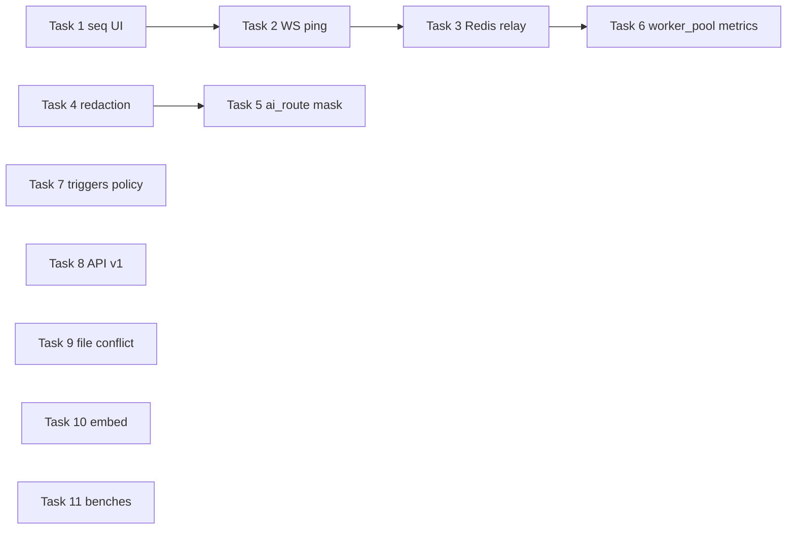

# GraphCaster — Forward Development Plan (post–Mar 2026 codebase)

> **For agentic workers:** REQUIRED SUB-SKILL: Use **superpowers:subagent-driven-development** (recommended) or **superpowers:executing-plans** to implement this plan **task-by-task**. Steps use checkbox (`- [ ]`) syntax for tracking.

**Goal:** Закрепить уже появившиеся подсистемы (expression, parallel, RAG, scaling, relay, triggers, API v1) в **единой проверяемой архитектуре**, закрыть **продакшен‑разрывы** транспорта и безопасности (как у n8n / Flowise / Dify), и дать **измеримую производительность** без дублирования оркестратора в репозитории хоста.

**Architecture:** Сохраняем **канон** «документ JSON → `GraphRunner` → NDJSON `run-event`»; все внешние контуры (**SSE/WS**, **webhook**, **Redis relay**, **очередь воркеров**) остаются **адаптерами** над одним событием на строку, как в `doc/RUN_EVENT_TRANSPORT.md`. Для горизонтального масштаба — **pub/sub + stateless broker** (паттерн Flowise `RedisEventPublisher` / n8n `relay-execution-lifecycle-event`), а не второй тип события. Для чувствительных данных — **двухфазная доставка** (метаданные всегда, полное тело — по политике), как n8n `nodeExecuteAfter` / `nodeExecuteAfterData`.

**Tech Stack:** Python 3.11+, Starlette run-broker, SQLite run catalog (опц.), Redis (coord + relay), UI React/Vite/Tauri, Vitest/pytest.

**SSOT по «уже сделано»:** `doc/IMPLEMENTED_FEATURES.md` (в т.ч. блок «Закрытая дорожная карта (март 2026)»). Этот документ **не** дублирует закрытые факты — только **следующие** инкременты.

---

## File map (затрагиваемые области следующих задач)

| Область | Пути (ориентиры) |
|---------|------------------|
| Транспорт / брокер | `python/graph_caster/run_broker/` (`broadcaster.py`, `sequence_generator.py`, `relay/`, `heartbeat.py`, `routes/ws.py`, `routes/http.py`) |
| События | `schemas/run-event.schema.json`, `python/graph_caster/run_transport/` |
| UI стрим | `ui/src/run/webRunBroker.ts`, `useRunBridge.ts`, `runSessionStore.ts`, `parseRunEventLine.ts` |
| Безопасность / redaction | `python/graph_caster/run_audit.py`, раннер/`run_event_sink`, при необходимости новый `python/graph_caster/redaction/` |
| Наблюдаемость | `python/graph_caster/observability/` |
| Исполнение / пул | `python/graph_caster/execution/` |
| Конкурентные референсы (read-only) | `n8n-master` Push/redaction, `Flowise-main` Redis SSE, `dify-main` GraphEngine/workers |

---

### Task 1: Потребительская упорядоченность по `seq` (UI + дев-транспорт)

**Зачем:** В брокере уже есть монотонный **`seq`** на JSON-строках (`sequence_generator.py`, тесты `test_run_broker_sequence.py`). При нескольких подписчиках или рестарте WS возможны **перестановки** на клиенте; для корректного `process_output` и таймлайна нужен **stable ordering** (аналогично заботе n8n о порядке push-сообщений).

**Files:**
- Modify: `ui/src/run/parseRunEventLine.ts` (или тонкий слой буфера перед `runSessionStore`)
- Modify: `ui/src/run/runSessionStore.ts` / `runEventSideEffects.ts` — опциональный буфер «reorder window» по `seq`
- Test: `ui/src/run/parseRunEventLine.test.ts` или новый `ui/src/run/runEventReorder.test.ts`
- Add: краткая запись в `doc/RUN_EVENT_TRANSPORT.md` §1–2 (поведение клиента)

- [x] **Step 1:** Написать падающий тест: два события с `seq` вне порядка → после нормализации порядок детерминирован.
- [x] **Step 2:** `cd ui && npm test -- --run` — ожидаем FAIL.
- [x] **Step 3:** Реализовать минимальный реордер (например max out-of-order **N** кадров или до `run_finished`).
- [x] **Step 4:** `npm test -- --run` — PASS; `npm run build` — PASS.
- [x] **Step 5:** Commit (scope: UI + doc transport).

---

### Task 2: WebSocket keepalive (prod-гигиена)

**Зачем:** `doc/RUN_EVENT_TRANSPORT.md` §4 рекомендует ping ~60s под nginx; n8n держит сессию тем же способом.

**Files:**
- Modify: `python/graph_caster/run_broker/routes/ws.py`, при необходимости `heartbeat.py`
- Modify: `ui/src/run/webRunBroker.ts` — игнор/обработка служебного `channel: ping` без поломки парсера
- Test: `python/tests/test_run_broker.py` или узкий новый тест на heartbeat
- Modify: `doc/RUN_EVENT_TRANSPORT.md` §4 — фактическая реализация

- [x] **Step 1:** Тест: после N секунд сервер шлёт кадр, клиент не рвёт подписку (мок таймера или короткий интервал в тесте).
- [x] **Step 2:** Реализация JSON `ping` / WS ping frame (выбрать **один** канон для GC).
- [x] **Step 3:** `cd python && py -3 -m pytest tests/test_run_broker.py -q` + при необходимости Vitest.
- [x] **Step 4:** Commit.

---

### Task 3: Relay событий через Redis (завершить контур «воркер ≠ broker»)

**Зачем:** Уже есть каркас `run_broker/relay/` (memory/redis). Нужен **end-to-end** сценарий: воркер пишет NDJSON в relay → broker читает → клиент видит тот же контракт, что §2 `RUN_EVENT_TRANSPORT` (как Flowise `MODE=QUEUE`).

**Files:**
- Modify: `python/graph_caster/run_broker/relay/redis_relay.py`, `registry_run_manager.py`, `python/README.md`
- Test: `python/tests/test_run_broker.py` или новый размерный `test_run_broker_relay_redis.py` (skip если нет Redis, как в других тестах проекта)
- Doc: абзац в `doc/COMPETITIVE_ANALYSIS.md` §39.2 — ссылка на **Evidence** (путь теста)

- [x] **Step 1:** Интеграционный тест с `fakeredis` или dockerized Redis (повторить паттерн `redis_coord`).
- [x] **Step 2:** Минимальная схема канала: ключ = `runId`, значение = строка NDJSON или обёртка из §2.
- [x] **Step 3:** pytest — PASS; задокументировать env vars.
- [x] **Step 4:** Commit.

---

### Task 4: Двухфазная redaction для событий с тяжёлым / чувствительным `node_outputs` (n8n-этикет)

**Зачем:** `PRODUCT_DESIGNE.md` §6 — маскирование секретов для ИИ; `COMPETITIVE_ANALYSIS.md` §3.2.2 — **метаданные сначала**, полное тело по политике.

**Files:**
- Create: `python/graph_caster/redaction/run_event_redaction.py` (или расширить `run_audit.py`)
- Modify: точка эмиссии «полного» снимка в `runner/graph_runner.py` / sink
- Modify: `schemas/run-event.schema.json` — только если нужен новый тип «мета без data» (избегать — предпочтительно усечение полей в существующих типах)
- Test: `python/tests/test_run_event_redaction.py`

- [x] **Step 1:** Тест: при флаге политики в `context` / env событие с `node_outputs_snapshot` не содержит ключей из denylist (или содержит плейсхолдер).
- [x] **Step 2:** Реализация: **`redaction/run_event_redaction.py`**, **`emit_node_outputs_snapshot`**, переиспользование **`_redact_object`** (**расширение `sensitiveOutputFields` в схеме — позже**).
- [x] **Step 3:** pytest PASS; **`python/README.md`** (**`GC_RUN_SNAPSHOT_REDACT`**).
- [x] **Step 4:** Commit (в этой сессии).

---

### Task 5: Маскирование payload для `ai_route` перед HTTP

**Зачем:** Явный продуктовый открытый пункт в `DEVELOPMENT_PLAN.md` фаза 2b / `PRODUCT_DESIGNE.md` §6.

**Files:**
- Modify: `python/graph_caster/ai_routing.py` (или выделить `ai_route_payload.py`)
- Test: `python/tests/test_ai_route_node.py` — фикстура с `envKeys` / ложными токенами в `node_outputs`

- [x] **Step 1:** Тест: в POST не попадает значение секрета из `node_outputs` (по пути вроде `headers.authorization`).
- [x] **Step 2:** Реализация: расширение **`_SENSITIVE_KEY_RE`** (**`authorization`**, **`cookie`**).
- [x] **Step 3:** pytest PASS.
- [x] **Step 4:** Commit (в этой сессии).

---

### Task 6: Связка `execution/worker_pool` с реестром брокера и метриками

**Зачем:** В дереве есть `execution/worker_pool.py` и `observability/metrics.py` — плановая задача **интеграции**, чтобы лимиты воркеров и очередь старта вели себя предсказуемо под нагрузкой (ориентир Dify `WorkerPool` / n8n fair queue).

**Files:**
- Modify: `python/graph_caster/run_broker/registry_run_manager.py`, `python/graph_caster/execution/worker_pool.py`
- Modify: `python/graph_caster/observability/metrics.py` — экспорт snapshot для `/health` или debug route (опц.)
- Test: `python/tests/test_worker_pool.py`, `test_run_broker.py`

- [x] **Step 1:** Тест: лимит воркеров брокера (**`test_run_broker_queues_second_run_when_max_concurrent_reached`**); **`gc_graph_fork_threadpool_max_config`** в **`prometheus_metrics_text`** (**`test_prometheus_text_includes_fork_threadpool_gauge`**); **`WorkerPool.in_flight_count`**.
- [x] **Step 2:** Гейздж **`gc_graph_fork_threadpool_max_config`** + **`in_flight_count`** (без второго глобального пула на hot path брокера).
- [x] **Step 3:** pytest `-q` PASS.
- [x] **Step 4:** Commit (в этой сессии).

---

### Task 7: Триггеры `trigger_schedule` / внешний планировщик

**Зачем:** `PRODUCT_DESIGNE.md` — встроенный планировщик «первую волну не делаем», но в коде есть `nodes/trigger_schedule.py` и `triggers/scheduler.py`. Нужно **явное** поведение: либо dev-only, либо opt-in через env, **документированное**, без сюрприза для локального MVP.

**Files:**
- Modify: `python/graph_caster/triggers/scheduler.py`, `nodes/trigger_schedule.py`, `python/README.md`
- Test: новый или существующий `python/tests/test_trigger_schedule.py`

- [x] **Step 1:** Тест: **`test_builtin_scheduler_disabled_by_default`**; среда **`GC_GRAPH_BUILTIN_SCHEDULER=1`** для существующих lifecycle-тестов.
- [x] **Step 2:** Реализация: **`GC_GRAPH_BUILTIN_SCHEDULER`**, **`builtin_scheduler_policy.py`**.
- [x] **Step 3:** pytest PASS.
- [x] **Step 4:** Commit (в этой сессии).

---

### Task 8: REST/OpenAPI **v1** как BFF-слой (Vibe-style «тонкий хост»)

**Зачем:** В репо есть `run_broker/routes/api_v1.py` / `api_v1_routes.py` — выровнять с **стабильным** контрактом для хоста: `POST /graphs/{id}/run`, `GET /runs/{id}`, совместимость с `runId` и NDJSON replay.

**Files:**
- Modify: указанные routes + `schemas/` при необходимости ответов
- Test: `python/tests/test_api_v1.py` (создать если нет)
- Doc: `python/README.md` — пример curl

- [x] **Step 1:** Контрактный тест OpenAPI (snapshot) или ручной `httpx` async test.
- [x] **Step 2:** Реализация недостающих путей **без** дублирования логики раннера.
- [x] **Step 3:** pytest PASS.
- [x] **Step 4:** Commit.

---

### Task 9: Редактор — конфликт autosave при внешнем изменении файла

**Зачем:** `IMPLEMENTED_FEATURES.md` F20 — «не сделано: конфликт файла на диске».

**Files:**
- Modify: `ui/src/layout/AppShell.tsx`, возможно `workspace` слой
- Test: Vitest с моком `stat` / версии файла

- [x] **Step 1:** Тест: файл изменён снаружи → баннер «перезагрузить / сохранить как».
- [x] **Step 2:** Реализация лёгкого `mtime` / hash check перед autosave.
- [x] **Step 3:** `npm test -- --run` PASS.
- [x] **Step 4:** Commit.

---

### Task 10: Пакет «встраивание» для хоста (фаза 10 `DEVELOPMENT_PLAN.md`)

**Зачем:** Стабильный способ подключить UI: экспорт `dist/`, версионирование `peerDependencies`, мини-док «IPC контракт».

**Files:**
- Modify: `ui/package.json` (exports), при необходимости `ui/src/embed.ts` entry
- Add: `doc/EMBED_HOST_INTEGRATION.md` **только если** продукт явно запросит файл; иначе секция в `python/README.md` + `doc/IMPLEMENTED_FEATURES.md`

- [x] **Step 1:** Собрать `npm run build` и зафиксировать **публичные** entrypoints (**`dist/index.html`**, ассеты Vite — см. **`ui/README.md`**).
- [x] **Step 2:** Контракт для хоста: **`GET /api/v1/openapi.json`**, события прогона — [`doc/RUN_EVENT_TRANSPORT.md`](../doc/RUN_EVENT_TRANSPORT.md) и **`python/README.md`**; отдельный npm-package с **`peerDependencies`** — вне MVP.
- [x] **Step 3:** Commit.

---

### Task 11: Нагрузочные бенчмарки (не CI gate)

**Зачем:** `2026-03-31-graph-caster-roadmap-plan.md` — Phase-level цифры только как benchmarks.

**Files:**
- Add: `python/tests/bench_run_broker.py` или `scripts/bench/` (вне pytest по умолчанию)
- Doc: `ui/README.md` / `python/README.md` — как запускать

- [x] **Step 1:** Скрипт **`python/scripts/bench_run_broker_fanout.py`** (грубый **lines/sec** на **`RunBroadcaster`**, N подписчиков).
- [x] **Step 2:** Вывод скрипта — локальная таблица для оператора; не CI gate (**`python/README.md`**).
- [x] **Step 3:** Commit (в этой сессии).

---

## Порядок выполнения (рекомендуемый)

Параллельно после **Task 4**: **Task 5** (независим). **Task 7–10** можно распределять субагентам после стабилизации транспорта (**1–3**).

---

## Execution handoff

План сохранён в `doc/superpowers/plans/2026-03-31-graph-caster-forward-development-plan.md`.

**Статус 2026-04-01:** Tasks **1–11** выполнены по коду; регрессия: `cd python && py -3 -m pytest tests -q` (**796** passed), `cd ui && npm test -- --run` (**481** passed), `npm run build`.

**1. Subagent-Driven (рекомендуется)** — свежий субагент на каждую задачу + двухстадийное ревью (spec → quality).

**2. Inline execution** — пакетами по 2–3 задачи с ручным чекпоинтом.

---

## Примечание для мейнтейнеров

Частично устаревшие формулировки в `doc/DEVELOPMENT_PLAN.md` (фазы 5–10 как «нужно сделать») следует **сверить** с `doc/IMPLEMENTED_FEATURES.md` § «Закрытая дорожная карта» при следующем редактировании плана — без раздувания дубликатов, только указатели.
